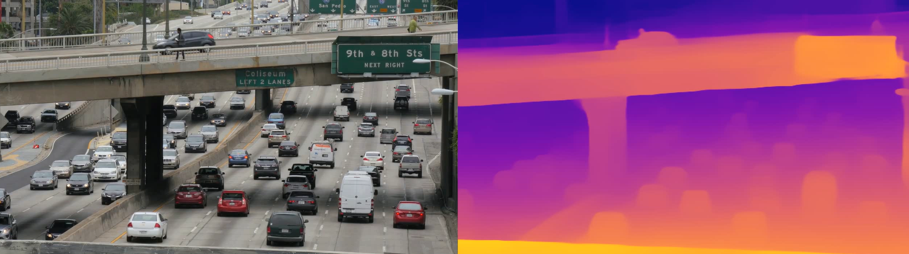

Realtime monocular depth estimation in video with Hugging Face

Humans view the world through two eyes. One of the primary benefits of this binocular vision is the ability to perceive depth — how near or far objects are. The human brain infers object depths by comparing the pictures captured by left and right eyes at the same time and interpreting the disparities. This process is known as stereopsis.

Just as depth perception plays a crucial role in human vision and navigation, the ability to estimate depth is critical for a wide range of computer vision applications, from autonomous driving to robotics, and even augmented reality. Yet a slew of practical considerations from spatial limitations to budgetary constraints often limit these applications to a single camera.

Monocular depth estimation (MDE) is the task of predicting the depth of a scene from a single image. Depth computation from a single image is inherently ambiguous, as there are multiple ways to project the same 3D scene onto the 2D plane of an image. As a result, MDE is a challenging task that requires (either explicitly or implicitly) factoring in many cues such as object size, occlusion, and perspective.
